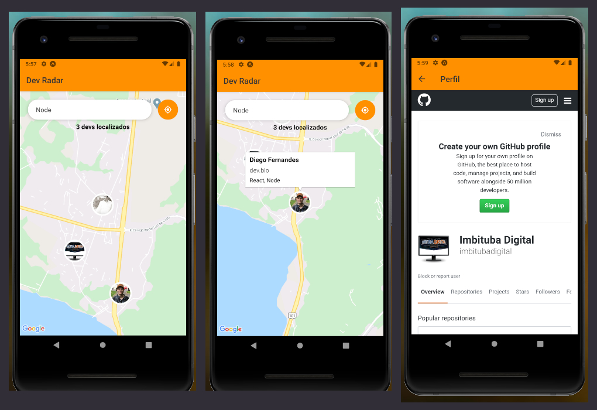

# Aplicativo Dev Radar

Implementação realizada por: **Antonio Joaquim Fernandes**
- Contato: **imbitubadigital@gmail.com**

## Especificações:

Projeto idealizado durante a Semana Oministck 10 da Rocketseat, tendo como objetivo o desenvolvimento de um **Aplicativo Mobile** integrado com mapa e pesquisa de Dev por tecnologias, conforme as regras de negócios implementadas no [Beckend](https://github.com/imbitubadigital/beckend-dev-radar) da aplicação .

## Desafio Pessoal

Como desafio pessoal foi integrado:

- sistema de **socke.io** durante a atualização e delete de devs,
- typescript ao projeto
- hooks de contexto

### Beckend da Aplicação

[Clique aqui](https://github.com/imbitubadigital/beckend-dev-radar) para visualizar e baixar o **Backend** da aplicação desenvolvido em **Node com Express**

### Projeto Web - Front-end React

[Clique aqui](https://github.com/imbitubadigital/sistema-de-tarefas) para visualizar e baixo o projeto fron-end desenvolvido em **ReactJS**

